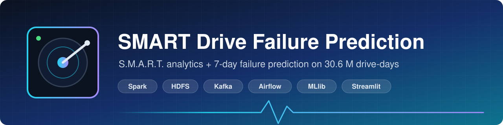
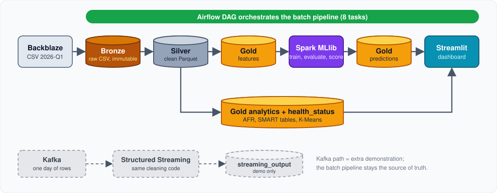
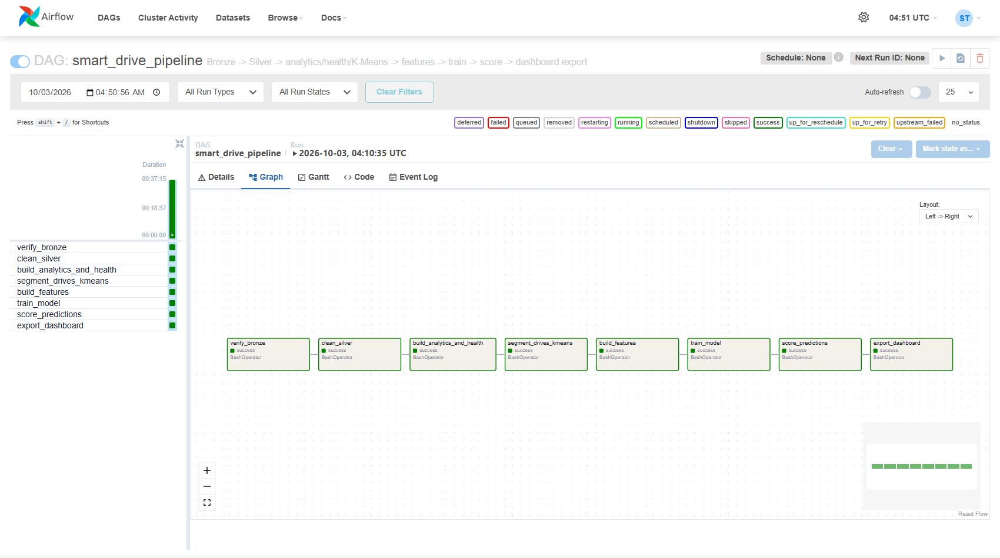
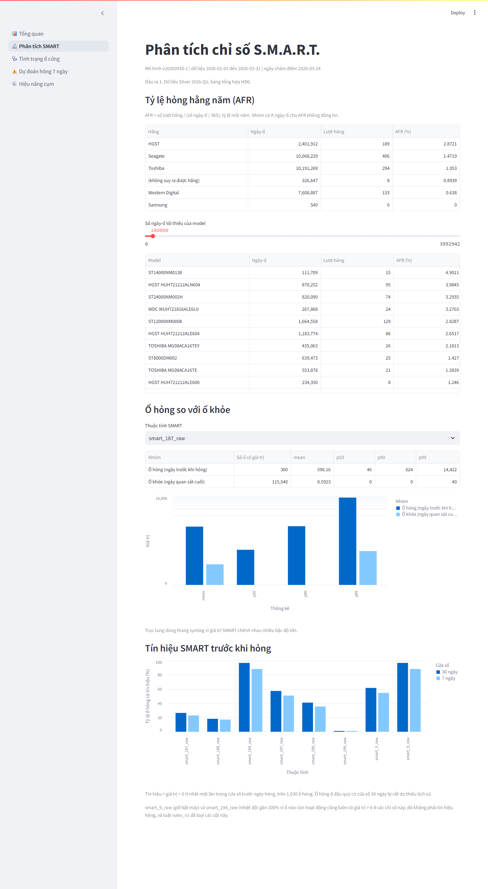
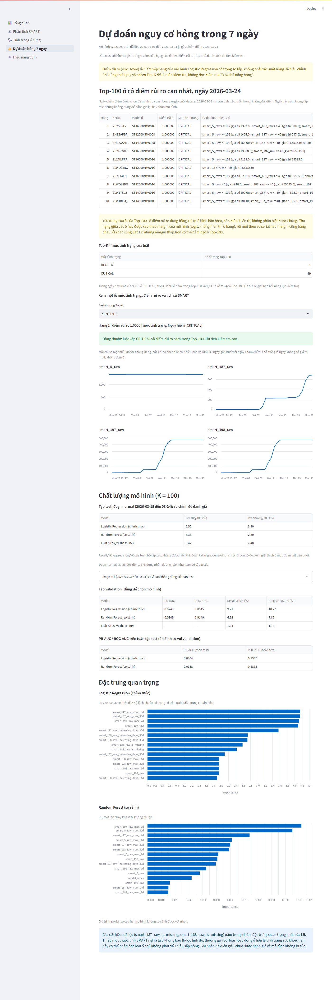
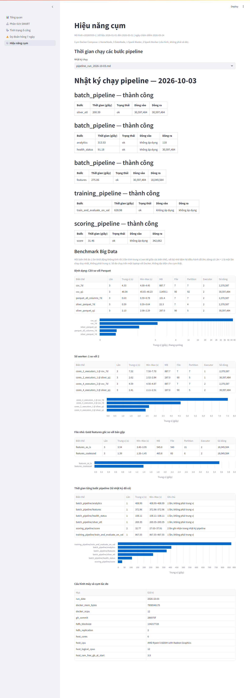
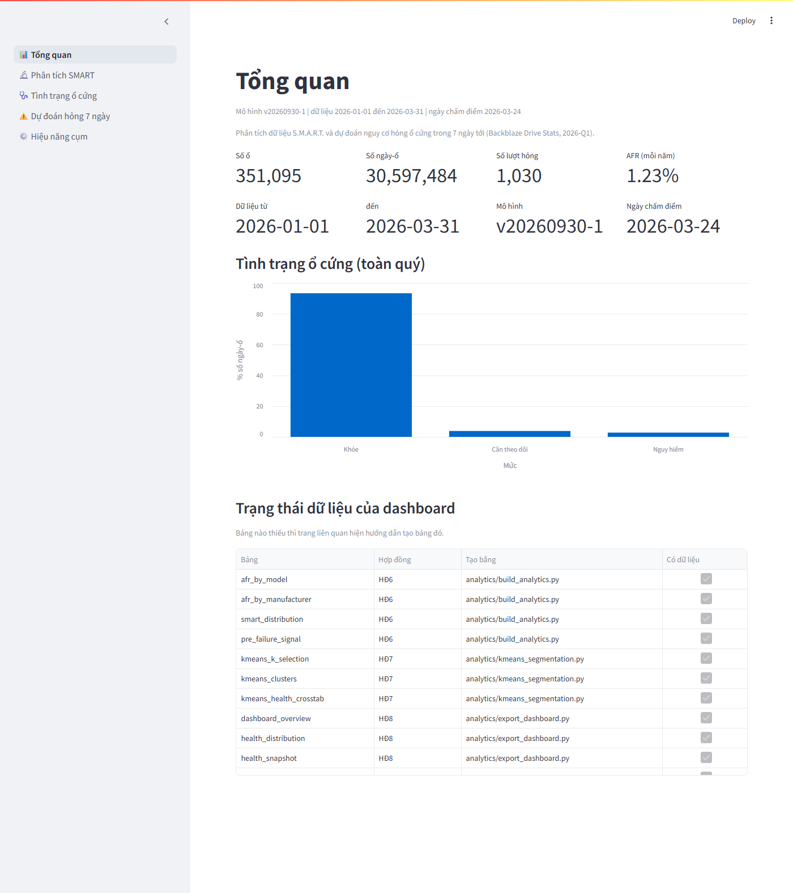
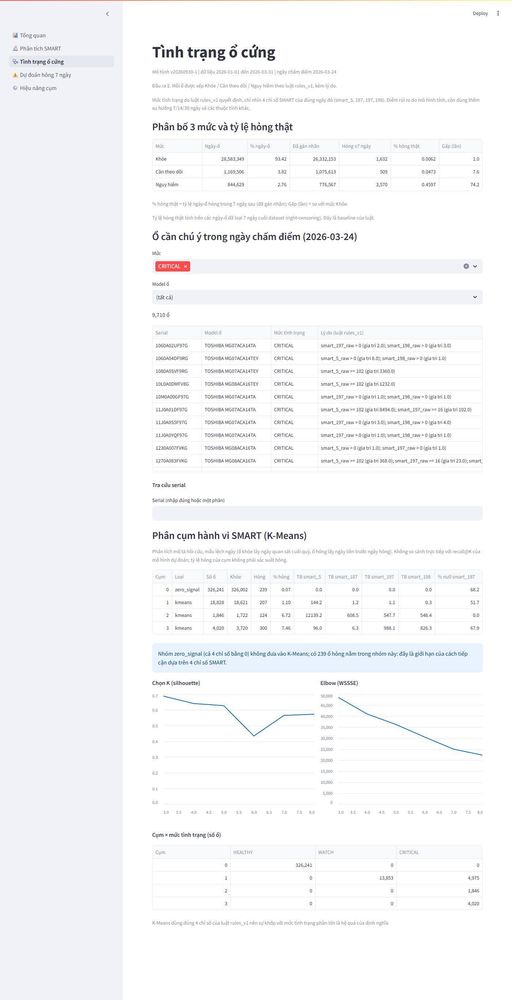

<p align="center">
  
</p>

<p align="center">
  
  
  
  
  
</p>
<p align="center">
  
  
  
  
  
</p>

<p align="center">
  <b>English</b> · <a href="README_vi.md">Tiếng Việt</a>
</p>

<p align="center">
  <a href="#at-a-glance">At a glance</a> ·
  <a href="#review">Review in 5 minutes</a> ·
  <a href="#architecture">Architecture</a> ·
  <a href="#results">Results</a> ·
  <a href="#dashboard">Dashboard</a> ·
  <a href="#quick-start">Quick start</a> ·
  <a href="#limitations">Limitations</a> ·
  <a href="#author">Author</a>
</p>

> [!NOTE]
> An end-to-end Big Data system on the public **Backblaze Drive Stats** data. Raw CSV goes into **HDFS**, is cleaned and analysed with **PySpark / Spark SQL**, scored with **Spark MLlib** and shown in a **Streamlit** dashboard. Everything runs on one machine with Docker Compose.

<a id="at-a-glance"></a>

## ⚡ At a glance

<table align="center">
  <tr>
    <td align="center"><h3>30.6 M</h3>drive-days<br><sub>2026-Q1, 90 days</sub></td>
    <td align="center"><h3>351 k</h3>drives<br><sub>1,030 failures</sub></td>
    <td align="center"><h3>74×</h3>failure rate of 🔴 Critical<br><sub>vs. 🟢 Healthy (7 days)</sub></td>
    <td align="center"><h3>21.6×</h3>faster scans<br><sub>Parquet vs. CSV, full quarter</sub></td>
    <td align="center"><h3>241</h3>tests passing<br><sub>run in a container</sub></td>
  </tr>
</table>

| # | Output | What you get |
|:-:|---|---|
| 1 | 📈 **S.M.A.R.T. analysis** | Annual failure rate (AFR) by manufacturer and model, healthy vs. failed distributions, signals before failure, K-Means segmentation |
| 2 | 🩺 **Health assessment** | Every drive and day is 🟢 *Healthy* / 🟡 *Watch* / 🔴 *Critical*, with the reason (which indicator triggered the rule) |
| 3 | 🎯 **Failure prediction** | Risk score that a drive fails within **7 days** and a daily **Top-100** alert list |

<a id="review"></a>

## 🧭 Review in 5 minutes

| If you want to… | Look at |
|---|---|
| **See it** | The [dashboard screenshots](#-dashboard) below, or run it (≈ 3 commands, [Quick start](#-quick-start)) |
| **Check the numbers** | [`docs/evaluation.md`](docs/evaluation.md) and the report snapshots in [`docs/results/`](docs/results/README.md) |
| **Check the rigor** | [`tests/test_leakage.py`](tests/test_leakage.py) and [`tests/test_labels.py`](tests/test_labels.py): time-based split, no future data in features, right-censoring handled |
| **See orchestration** | [`dags/smart_drive_pipeline_dag.py`](dags/smart_drive_pipeline_dag.py): 8 tasks, ran green in 37 min ([graph](docs/images/airflow_graph.png)) |
| **See streaming** | [`docs/results/streaming_demo.md`](docs/results/streaming_demo.md): 338,760 messages through Kafka, checked against Silver |
| **See performance** | [`docs/results/benchmark.md`](docs/results/benchmark.md): CSV vs. Parquet, 1 vs. 2 executors, small files |

<a id="architecture"></a>

## 🏗 Architecture

<p align="center"></p>

> [!IMPORTANT]
> The batch pipeline (Bronze → Silver → Gold) is the source for analysis and training. Kafka is an additional near-real-time **demonstration** and does not replace it.

**Cluster (Docker Compose):** 1 NameNode, 3 DataNodes (replication 2, Bronze 1), 1 Spark master, 2 Spark workers (2 cores, 2 GiB each), Streamlit, plus optional `streaming` (ZooKeeper + Kafka) and `orchestration` (Airflow) profiles. Central settings: `config/project.yaml`. More: [`docs/service-architecture.md`](docs/service-architecture.md).

### Data layers

| Layer | Path in HDFS | Format | Content |
|---|---|---|---|
| 🟤 **Bronze** | `/smart-drive/bronze/year=…/quarter=…/` | CSV, immutable | Raw daily Backblaze files, 197 columns |
| ⚪ **Silver** | `/smart-drive/silver/daily` | Parquet, by `date` | `date`, `serial_number`, `model`, `manufacturer`, `capacity_bytes`, `failure` + 8 raw SMART columns; unique key `(serial_number, date)` |
| 🟡 **Gold `features`** | `/smart-drive/gold/features` | Parquet, by `date` | 90 features, label `fail_within_7_days`, `split` (train / val / test) |
| 🟡 **Gold `health_status`** | `/smart-drive/gold/health_status` | Parquet, by `date` | `health_level`, `reasons[]`, `rules_version` |
| 🟡 **Gold `predictions`** | `/smart-drive/gold/predictions` | Parquet, by `date` | `risk_score`, `risk_rank`, `alert` (Top-K), `model_version` |
| 🟡 **Gold `analytics`** | `/smart-drive/gold/analytics/` | Parquet | AFR by model / manufacturer, SMART distributions, signal before failure, K-Means tables |
| 🟣 **Model** | `/smart-drive/models/v20260930-1/` | Spark ML pipeline | Logistic Regression + `feature_list.json`, `threshold.json`, `metrics.json` |

### The nine course steps → where they live

| # | Step | Implementation |
|:-:|---|---|
| 1 | Prepare HDFS | `docker-compose.yml`; Bronze / Silver / Gold layout under `/smart-drive` ([quick start](docs/quick-start.md), section 3) |
| 2 | Upload data | `scripts/upload_to_hdfs.py`, `ingestion/hdfs_loader.py`, `ingestion/dataset_validator.py`; check with `scripts/verify_bronze.py` |
| 3 | Read with Spark | `processing/spark_jobs/smart_etl.py`: Bronze CSV read from HDFS with `header=true` and no `inferSchema`, so every column arrives as text and is cast explicitly in step 4 |
| 4 | Clean data | `smart_etl.py`: explicit casts, null handling, de-duplication on (serial, date), Silver Parquet by date; `smart_cleaning.py`: data-quality checks (duplicate keys, implausible values, missing days) |
| 5 | Spark SQL | `spark.sql` on temporary views in exactly five files: `analytics/build_analytics.py` (AFR, SMART distributions, signal before failure), `failure_analysis.py`, `drive_model_analysis.py`, `kmeans_segmentation.py`, `export_dashboard.py`. The `rules_v1` rules in `health_status.py` and the helpers in `smart_analysis.py` use the DataFrame API; the three-level distribution is counted with SQL in `export_dashboard.py` |
| 6 | Advanced analysis | `analytics/kmeans_segmentation.py` (K-Means on SMART behaviour); `ml/train.py`, `ml/evaluate.py` (Logistic Regression, Random Forest) |
| 7 | Save results | Gold tables (Parquet on HDFS); dashboard tables exported by `analytics/export_dashboard.py` |
| 8 | Kafka ingest | `ingestion/kafka_producer.py`, `pipeline/streaming_consumer.py`, `scripts/run_streaming_demo.py` |
| 9 | Airflow DAG | `dags/smart_drive_pipeline_dag.py` (8 sequential tasks), `Dockerfile.airflow` |

<p align="center"></p>

<a id="results"></a>

## 📊 Results

> [!NOTE]
> Every number comes from a real run on 2026-Q1 and from the reports in [`docs/results/`](docs/results/README.md) or [`docs/evaluation.md`](docs/evaluation.md) (Vietnamese). Splits are **by time**: train 2026-01-31 → 03-03, validation 03-04 → 03-14, test 03-15 → 03-31. The test set was evaluated **exactly once**, after the model was chosen on validation.

### 🩺 Data and health assessment

| | |
|---|---|
| Silver | **30,597,484** drive-days, **0** duplicate keys, 1,030 failures, 350,065 drives that never failed |
| Overall AFR | **1.23 %** (annualised from 90 days). HGST 2.87 %, Seagate 1.47 %, Toshiba 1.05 %, Western Digital 0.64 % |
| Rule set `rules_v1` | Uses `smart_5`, `smart_187`, `smart_197`, `smart_198` (see thresholds below) |

| Level | Share of drive-days | Observed 7-day failure rate | vs. Healthy |
|---|--:|--:|--:|
| 🟢 Healthy | 93.42 % | 0.0062 % | 1× |
| 🟡 Watch | 3.82 % | 0.0473 % | ≈ 7.6× |
| 🔴 Critical | 2.76 % | 0.4597 % | **≈ 74×** |

<details>
<summary><b>Thresholds of <code>rules_v1</code></b> (chosen from the data, not guessed)</summary>

| Level | Condition |
|---|---|
| 🟢 **Healthy** | `smart_5`, `smart_187`, `smart_197` and `smart_198` are all `0` |
| 🟡 **Watch** | exactly one of the four is `> 0` |
| 🔴 **Critical** | two or more are `> 0` on the same day, **or** one reaches its severity threshold: `smart_5 ≥ 102`, `smart_187 ≥ 40`, `smart_197 ≥ 16`, `smart_198 ≥ 8` (the 99th percentile of healthy drives) |

`smart_9` (power-on hours), `smart_194` (temperature) and `smart_199` (CRC errors) are **not** used: they do not separate failing drives in this data. Using "`> 0`" on `smart_5` alone as *Critical* would raise 5.4 % false alarms among healthy drives, far above a 100-drives-a-day inspection capacity.

</details>

### 🧩 K-Means segmentation (descriptive)

K = 3 chosen by silhouette (0.6870) **after** separating the `zero_signal` group (all four indicators equal to 0).

| Cluster | Drives | Failed | Failed share | Profile |
|:-:|--:|--:|--:|---|
| 0 · `zero_signal` | 326,241 | 239 | 0.07 % | no signal on the four indicators |
| 1 | 18,828 | 207 | 1.10 % | mild signals |
| 2 | 1,846 | 124 | 6.72 % | many reallocated sectors (`smart_5`) |
| 3 | 4,020 | 300 | 7.46 % | pending / offline sectors (`smart_197`, `smart_198`) |

<sub>The segmentation uses the same four indicators as the rules, so its agreement with the health levels is partly by construction. It is a description, not an independent validation. Source: [`kmeans_segmentation.md`](docs/results/kmeans_segmentation.md).</sub>

<p align="center"></p>

### 🎯 Failure prediction

**Model:** Logistic Regression, chosen on validation. **Metric:** recall and precision among the Top-100 drives of each day. 90 features (8 SMART values, 8 missing-value flags, 72 rolling-window features over 7 / 14 / 30 days, 2 category indexes).

| Set | Method | Recall@100 | Precision@100 |
|---|---|--:|--:|
| Validation | **Logistic Regression** | **9.21 %** | **10.27 %** |
| Validation | Baseline `rules_v1` | 1.64 % | 1.73 % |
| Test, `normal` segment (03-15 → 03-24) | **Logistic Regression** | **5.55 %** | **3.80 %** |
| Test, `normal` segment | Baseline `rules_v1` | 3.47 % | 2.40 % |

> [!IMPORTANT]
> **How to read the test numbers.** The last 7 days of the dataset are right-censored: they keep only rows of drives already known to fail, so *any* method scores trivially there. Test results are therefore reported on the **`normal` segment** (99.99 % of test rows); the reasoning is in section 3 of [`docs/evaluation.md`](docs/evaluation.md). The model finds about **5.6×** more failures than the rule baseline in the Top-100 on validation and about **1.6×** on the test `normal` segment. PR-AUC is low (0.0245 on validation) because positives are extremely rare (≈ 0.02 % of rows).

> [!NOTE]
> `risk_score` is a **ranking score** from a class-weighted model, not a calibrated probability. Many drives saturate at 1.0, so ties are broken by the model margin, and recall@100 depends on the tie-break rule (9.21 % vs. 9.06 % on validation).

> [!TIP]
> **Date picker and the next quarter.** The prediction page has a date picker: choose any day whose full 7-day horizon is observed to see that day's Top-100, the `rules_v1` level, what actually happened to each listed drive afterwards, and its SMART history. Every day is labelled with its split, and days from the training or validation set carry a warning because the model has already seen them. The frozen model was also checked once on the next quarter (Q2-2026, out-of-time): on its `normal` segment it reaches recall@100 **8.23 %** and precision@100 **9.32 %** against 2.12 % and 2.68 % for the rules; details and caveats in [`oot_evaluation.md`](docs/results/oot_evaluation.md). To refresh the picker run `ml/score_daily.py`, then `analytics/export_dashboard.py` (see [Quick start](#quick-start)).

<p align="center"></p>

### ⚡ Performance and streaming

Medians of 3 runs on one laptop (Ryzen 5 6600H, 15.2 GB RAM, Docker 7.36 GiB). Sources: [`benchmark.md`](docs/results/benchmark.md), [`pipeline_run_2026-10-03.md`](docs/results/pipeline_run_2026-10-03.md), [`streaming_demo.md`](docs/results/streaming_demo.md).

| Experiment | Result |
|---|---|
| 🗜 **Silver Parquet vs. raw CSV**, full quarter, same `count + groupBy(model)` query | **2.13 s vs. 46.04 s** (21.6× faster); 287 MB vs. 11.2 GB |
| 📦 **Small files**: Gold features 540 → 60 files | 3.54 s → 1.39 s (2.55×) |
| 🧮 **1 vs. 2 executors**, 7-day CSV workload | 7.52 s → 4.59 s; on Silver Parquet the gap is small (2.62 s → 2.41 s) because start-up dominates |
| 🔁 **End-to-end run**, 2026-10-03 | Silver 200 s · analytics 314 s · health status 91 s · features 275 s · training 629 s · scoring 31 s (342,662 rows) |
| 🌀 **Kafka demo**, one day (2026-01-01) | 338,760 messages sent, acknowledged and written; rows, distinct serials and failures **match Silver**; peak Docker memory 4.75 GiB of 7.36 GiB |
| 🗓 **Airflow DAG**, 8 tasks | all green in 37 min |

<p align="center"></p>

<a id="dashboard"></a>

## 🖥 Dashboard

Five pages, read-only on small exported tables. A page whose table is missing shows how to create it instead of failing.

<table>
  <tr>
    <td width="50%"><b>Overview</b><br></td>
    <td width="50%"><b>S.M.A.R.T. analysis</b><br></td>
  </tr>
  <tr>
    <td width="50%"><b>Drive health + K-Means</b><br></td>
    <td width="50%"><b>Failure prediction (Top-100)</b><br></td>
  </tr>
</table>

<a id="quick-start"></a>

## 🚀 Quick start

> [!WARNING]
> Give Docker **at least 7.5 GiB** of RAM (16 GB on the machine is recommended). Run Spark jobs **one at a time**. On an 8 GB laptop lower `SPARK_WORKER_MEMORY` and `SPARK_WORKER_CORES` in `.env` first.

**Requirements:** Windows 11 with WSL2 + Docker Desktop (Compose v2); free disk for the raw CSV (11.2 GB per quarter) plus HDFS replicas; Python 3 on the host only for small scripts (`pip install pyyaml requests`). Spark jobs and tests run in containers.

**Data:** [Backblaze Drive Stats](https://www.backblaze.com/cloud-storage/resources/hard-drive-test-data), quarter 2026-Q1 (`data_Q1_2026.zip`). Cite Backblaze as the source, do not redistribute or sell the dataset, and read the terms on the download page (they take precedence over this summary). The data is **not** part of this repository.

**1 · Start the cluster**

```bash
cp .env.example .env            # PowerShell: Copy-Item .env.example .env
docker compose up -d --build
docker compose ps               # NameNode, 3 DataNodes, Spark master, 2 workers, ui-dashboard
```

NameNode UI → http://localhost:9870 · Spark master UI → http://localhost:8080

**2 · Get the data and load Bronze**

```bash
python scripts/download_dataset.py            # downloads data_Q1_2026.zip into dataset/raw/; unzip it
```

In `docker-compose.yml` the `namenode` service mounts the folder with the extracted CSV files read-only at `/external_data` (the left side of the `:/external_data:ro` volume). Point it to your own folder, then:

```bash
docker compose config > /dev/null && docker compose up -d namenode
python scripts/upload_to_hdfs.py --host-source-dir <folder-with-csv-on-host> \
  --container-source-dir /external_data/<subfolder> --start-date 2026-01-01 --end-date 2026-03-31
python scripts/verify_bronze.py               # exit code 0 when every day is present
```

**3 · Run the pipelines** (Spark jobs run inside `spark-master`)

```bash
SUBMIT="docker compose exec -e PYTHONPATH=/opt/smart-drive spark-master /opt/spark/bin/spark-submit --master spark://spark-master:7077"
$SUBMIT /opt/smart-drive/scripts/run_batch_pipeline.py       # Bronze -> Silver -> analytics, health_status, features
$SUBMIT /opt/smart-drive/scripts/run_training_pipeline.py    # train + evaluate on validation only
$SUBMIT /opt/smart-drive/scripts/run_scoring_pipeline.py --date 2026-03-24   # Gold predictions
```

`run_batch_pipeline.py --steps silver_etl,analytics,health_status,features` selects steps. Each run writes a log to `artifacts/reports/pipeline_run_<date>.md`.

**4 · K-Means, dashboard tables, dashboard**

```bash
$SUBMIT /opt/smart-drive/analytics/kmeans_segmentation.py    # about 8-12 minutes
$SUBMIT /opt/smart-drive/ml/score_daily.py                   # Top-100 of every scorable day (date picker)
$SUBMIT /opt/smart-drive/analytics/export_dashboard.py       # needs Gold predictions
docker compose restart ui-dashboard                          # http://localhost:8501
```

<details>
<summary><b>Or run everything with Airflow</b> (DAG <code>smart_drive_pipeline</code>, 8 tasks, manual trigger)</summary>

Set `AIRFLOW_ADMIN_PASSWORD` in `.env` first (your own password; never commit `.env`).

```bash
docker compose --profile orchestration build
docker compose stop ui-dashboard                       # free memory
docker compose --profile orchestration up -d           # UI: http://127.0.0.1:8081
docker compose exec airflow-scheduler airflow dags trigger smart_drive_pipeline
```

Loading Bronze stays a manual step; the DAG only **verifies** it. `train_model` trains and evaluates on train/validation only and never touches the test split.

</details>

<details>
<summary><b>Kafka demo</b> (one day of data; close heavy applications first and stop <code>ui-dashboard</code>)</summary>

```bash
python -m venv .venv-kafka
.venv-kafka/Scripts/python -m pip install -r requirements-streaming.txt   # Linux/macOS: .venv-kafka/bin/python
.venv-kafka/Scripts/python scripts/run_streaming_demo.py --host-source-dir <folder-with-csv-on-host> \
  --dates 2026-01-01 --start-kafka --stop-kafka
```

The report is written to `artifacts/reports/streaming_demo.md`. `--stop-kafka` stops only ZooKeeper and Kafka and removes nothing.

</details>

<details>
<summary><b>Benchmark and tests</b></summary>

The benchmark needs an idle cluster; the exact sequence is in section 9 of [`docs/quick-start.md`](docs/quick-start.md). Tests run in a container:

```bash
docker compose run --rm tests python3 -m pytest -q
```

</details>

> [!CAUTION]
> Stop the stack with `docker compose down`, which keeps the HDFS volumes. **Do not add `-v`** unless you want to erase all HDFS data.

### Troubleshooting

| Symptom | Fix |
|---|---|
| A dashboard page says a table is missing | Run the export commands of step 4; the page shows the exact command |
| Airflow init stops with a message about the password | Set `AIRFLOW_ADMIN_PASSWORD` in `.env` |
| A Spark job is refused ("another application is running") | Wait for the running job; the guard allows one Spark job at a time (RAM is the limit) |
| A host client cannot connect to Kafka | Use `127.0.0.1:9092` (the broker is published on 127.0.0.1 only) |
| "Page not found" after refreshing a dashboard sub-page | Open `http://localhost:8501` and use the sidebar |
| A port is already in use | Change the port variable in `.env` (names below) |

## 🗂 Repository layout and environment variables

<details>
<summary><b>Repository layout</b></summary>

```text
config/                 central settings (project.yaml), HDFS configuration
ingestion/              download, validation, Bronze loading, Kafka producer
processing/spark_jobs/  Bronze -> Silver (cleaning), schema profiling
features/               7-day label and rolling features
ml/                     train, evaluate, score
analytics/              SMART analysis, health status, K-Means, dashboard export, benchmark
pipeline/               batch, training and scoring pipelines, streaming consumer, DAG spec
dags/                   Airflow DAG
scripts/                entry points (batch, training, scoring, streaming demo, benchmark, checks)
ui_dashboard/           Streamlit app (app.py, views/)
tests/                  unit tests on small fixtures (no cluster needed)
docs/                   quick start, architecture, evaluation, result snapshots, images
artifacts/              generated reports and dashboard tables (not tracked by git)
```

</details>

<details>
<summary><b>Environment variables</b> (names only; defaults are in <code>.env.example</code>)</summary>

| Variable | Used by |
|---|---|
| `HDFS_REPLICATION_FACTOR` | HDFS replication |
| `NAMENODE_WEB_PORT`, `NAMENODE_RPC_PORT` | NameNode ports |
| `SPARK_MASTER_WEB_PORT`, `SPARK_MASTER_PORT` | Spark master ports |
| `SPARK_WORKER_MEMORY`, `SPARK_WORKER_CORES` | Spark worker resources |
| `DASHBOARD_PORT` | Streamlit port |
| `AIRFLOW_WEB_PORT`, `AIRFLOW_ADMIN_PASSWORD` | Airflow UI port and admin account |
| `KAFKA_PORT` | Kafka port (published on 127.0.0.1 only) |

</details>

<details>
<summary><b>How leakage is prevented</b></summary>

- The split is **by day**, never random: train 01-31 → 03-03, validation 03-04 → 03-14, test 03-15 → 03-31 (no overlap). The first 30 days are warm-up for the rolling windows.
- Features of day *t* use only data up to day *t*; `serial_number` and the current `failure` flag are never features; category indexes are fitted on train only.
- Rows after a drive's failure are removed; windows that cross the end of the data are right-censored (dropped) unless the failure is already observed.
- [`tests/test_leakage.py`](tests/test_leakage.py) changes the data after day *t* and checks that the features of day *t* do not move, that no forbidden column exists and that the split periods do not overlap.

</details>

<a id="limitations"></a>

## ⚠ Limitations

- **One quarter** of data (2026-Q1, 90 days). Rule thresholds and the model come from the same quarter and may not generalise.
- **Rare positives** (≈ 0.02 % of rows): PR-AUC is low and recall@100 is modest in absolute terms (5.55 % on the test `normal` segment).
- **About a quarter of failed drives show no signal** on the four indicators: 27.5 % (239 of 870) on the day before failure, 26.4 % (244 of 923) over 7 days, 24.0 % (241 of 1,003) over 30 days; the denominators differ per window ([`docs/evaluation.md`](docs/evaluation.md), section 5.1).
- **Random Forest is not reproducible:** re-training on the same split gave different metrics, so Logistic Regression is the official model.
- The last 7 days are right-censored, so test metrics are reported on the `normal` segment only.
- Manufacturer is derived from the model-name prefix by a code rule, not from a Backblaze field.
- The benchmark and the Airflow setup (SQLite, sequential executor) are single-machine demonstrations. The Kafka demo replays one day of existing data and is not a live feed.

**Future work:** more quarters with rolling evaluation · analysis of individual missed failures · probability calibration, Random Forest tuning · a scheduled DAG with a production executor and scoring fed from the streaming path.

<a id="author"></a>

## 👤 Author

<table>
  <tr>
    <td width="120" align="center"><a href="https://github.com/hongquocAI"></a></td>
    <td>
      <b>Lê Hồng Quốc</b><br>
      Built the system end to end: data layers on HDFS, Spark pipelines, models, dashboard, Airflow and Kafka.<br>
      <a href="https://github.com/hongquocAI"></a>
    </td>
  </tr>
</table>

<details>
<summary><b>What I learned</b></summary>

- Designing **Bronze / Silver / Gold** layers on HDFS with explicit data contracts between them.
- Preventing **leakage** when labelling a time series: time-based splits, right-censoring, features that only look backwards.
- Evaluating **honestly** when positives are 0.02 % of the rows: reading metrics per segment, reporting what the baseline already achieves, measuring the effect of tie-breaking.
- **Orchestrating** with Airflow and verifying a Kafka demo against the batch result instead of trusting it.
- **Measuring** instead of guessing: CSV vs. Parquet, executors, small files, memory limits.

</details>

## 📄 License and acknowledgements

Code: [MIT](LICENSE) © 2026 Lê Hồng Quốc and contributors. The dataset is **not** included and keeps Backblaze's terms.

Thanks to **Backblaze** for publishing Drive Stats, and to Reuben Khang Nguyen for the initial repository scaffold.
