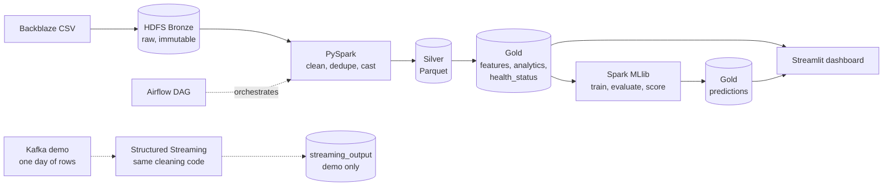

# SMART Drive Failure

**S.M.A.R.T. data analysis and 7-day hard-drive failure prediction with Apache Spark.**

An end-to-end Big Data system built on the public Backblaze Drive Stats data (2026-Q1, 30.6 million drive-days, 1,030 failures). Raw CSV files are stored in HDFS, cleaned and analysed with PySpark and Spark SQL, scored with Spark MLlib, and presented in a Streamlit dashboard. The whole stack runs on one machine with Docker Compose.

Vietnamese version: [README_vi.md](README_vi.md).


## Contents

1. [Outputs](#1-outputs)
2. [Architecture](#2-architecture)
3. [Results](#3-results)
4. [Requirements and data](#4-requirements-and-data)
5. [Run from an empty checkout](#5-run-from-an-empty-checkout)
6. [Repository layout and environment variables](#6-repository-layout-and-environment-variables)
7. [Limitations and future work](#7-limitations-and-future-work)

## 1. Outputs

| # | Output | Where it lives |
|---|---|---|
| 1 | **S.M.A.R.T. analysis**: annual failure rate (AFR) by manufacturer and model, healthy vs. failed distributions, signals before failure, K-Means segmentation | `analytics/`, Gold `analytics`, dashboard pages *Phân tích SMART* and *Tình trạng ổ cứng* |
| 2 | **Health assessment** per drive and day: *Healthy / Watch / Critical*, with the reason (which indicators triggered the rule) | Gold `health_status`, rule set `rules_v1` |
| 3 | Read with Spark | `processing/spark_jobs/smart_etl.py`: Spark reads the Bronze CSV files from HDFS with `header=true` and no `inferSchema`, so every column arrives as text and is cast explicitly in step 4 |

## 2. Architecture



The batch pipeline (Bronze → Silver → Gold) is the source for analysis and training. Kafka is an additional near-real-time demonstration and does not replace it.

Cluster (Docker Compose): 1 NameNode, 3 DataNodes (HDFS replication 2; Bronze 1), 1 Spark master, 2 Spark workers (2 cores and 2 GiB each), the Streamlit service, and optional `streaming` (ZooKeeper + Kafka) and `orchestration` (Airflow) profiles. Central configuration: `config/project.yaml`. More detail: [docs/service-architecture.md](docs/service-architecture.md).

### Course steps and where they are implemented

| # | Step | Implementation |
|---|---|---|
| 1 | Prepare HDFS | `docker-compose.yml`; Bronze/Silver/Gold layout under `/smart-drive` ([docs/quick-start.md](docs/quick-start.md), section 3) |
| 2 | Upload data | `scripts/upload_to_hdfs.py`, `ingestion/hdfs_loader.py`, `ingestion/dataset_validator.py`; check with `scripts/verify_bronze.py` |
| 3 | Read with Spark | `processing/spark_jobs/smart_etl.py`: Spark reads the Bronze CSV files from HDFS with `header=true` and no `inferSchema`, so every column arrives as text and is cast explicitly in step 4 |
| 4 | Clean data | `processing/spark_jobs/smart_etl.py`: explicit casts, null handling, de-duplication on (serial, date), Silver Parquet partitioned by date; `smart_cleaning.py`: data-quality checks (duplicate keys, implausible values, missing days) |
| 5 | Spark SQL | `spark.sql` on temporary views in exactly five files: `analytics/build_analytics.py` (AFR, SMART distributions, signal before failure), `failure_analysis.py`, `drive_model_analysis.py`, `kmeans_segmentation.py`, `export_dashboard.py`. The `rules_v1` rules in `analytics/health_status.py` and the helpers in `analytics/smart_analysis.py` use the DataFrame API; the three-level distribution is counted with SQL in `export_dashboard.py` |
| 6 | Advanced analysis / clustering | `analytics/kmeans_segmentation.py` (K-Means on SMART behaviour); `ml/train.py`, `ml/evaluate.py` (Logistic Regression and Random Forest) |
| 7 | Save results | Gold tables `features`, `analytics`, `health_status`, `predictions` (Parquet on HDFS); dashboard tables exported by `analytics/export_dashboard.py` |
| 8 | Kafka ingest | `ingestion/kafka_producer.py`, `pipeline/streaming_consumer.py`, `scripts/run_streaming_demo.py` |
| 9 | Airflow DAG | `dags/smart_drive_pipeline_dag.py` (8 sequential tasks), `Dockerfile.airflow` |


## 3. Results

Every number below comes from a real run on 2026-Q1 and from the reports in [`docs/results/`](docs/results/README.md) or [`docs/evaluation.md`](docs/evaluation.md) (Vietnamese). Splits are by time: train 2026-01-31 → 03-03, validation 03-04 → 03-14, test 03-15 → 03-31. The test set was evaluated exactly once, after the model was chosen on validation.

### Data and health assessment

Source: [`eda_summary.md`](docs/results/eda_summary.md), [`health_baseline.md`](docs/results/health_baseline.md), [`data_quality.md`](docs/results/data_quality.md).

- Silver: 30,597,484 drive-days, 0 duplicate keys; 1,030 failures; 350,065 drives that never failed; overall AFR 1.23% (annualised from 90 days).
- Rule set `rules_v1` (smart_5, smart_187, smart_197, smart_198) gives Healthy 93.42%, Watch 3.82%, Critical 2.76% of drive-days. The observed 7-day failure rate rises with the level: 0.0062% (Healthy), 0.0473% (Watch, about 7.6×), 0.4597% (Critical, about 74×).
- K-Means ([`kmeans_segmentation.md`](docs/results/kmeans_segmentation.md)): K = 3 chosen by silhouette (0.6870) after separating the `zero_signal` group (326,241 drives with all four indicators equal to 0). The segmentation is descriptive, not an independent validation of the rules, because it uses the same four indicators.


### Failure prediction

Model: Logistic Regression (chosen on validation). Metric: recall and precision among the Top-100 drives per day. Source: [`docs/evaluation.md`](docs/evaluation.md), sections 1 and 3.

| Set | Method | Recall@100 | Precision@100 |
|---|---|---|---|
| Validation | **Logistic Regression** | **9.21%** | **10.27%** |
| Validation | Baseline `rules_v1` | 1.64% | 1.73% |
| Test, `normal` segment (2026-03-15 → 03-24) | **Logistic Regression** | **5.55%** | **3.80%** |
| Test, `normal` segment | Baseline `rules_v1` | 3.47% | 2.40% |

The last 7 days of the dataset (right-censored) contain only rows of drives already known to fail, so any method scores trivially there. The test results are therefore reported on the `normal` segment (99.99% of test rows); the reasoning is in section 3 of the evaluation. On the validation set the model detects about 5.6 times as many failures in the Top-100 as the rule baseline, and about 1.6 times as many on the test `normal` segment. PR-AUC is low (0.0245 on validation) because positives are very rare (about 0.02% of rows).


### Performance and streaming

Sources: [`benchmark.md`](docs/results/benchmark.md), [`pipeline_run_2026-10-03.md`](docs/results/pipeline_run_2026-10-03.md), [`streaming_demo.md`](docs/results/streaming_demo.md). All measurements are medians of 3 runs on one laptop with Docker (not a production cluster).

- Silver Parquet vs. raw CSV on the full quarter: 2.13 s vs. 46.04 s for the same `count + groupBy(model)` query (21.6× faster; 287 MB vs. 11.2 GB).
- Compacting Gold features from 540 to 60 files: 3.54 s → 1.39 s (2.55×).
- One executor vs. two on a 7-day CSV workload: 7.52 s → 4.59 s; on Silver Parquet the difference is small (2.62 s → 2.41 s).
- One end-to-end run on 2026-10-03: Silver 200 s, analytics 314 s, health status 91 s, features 275 s, training (train + validation) 629 s, scoring 31 s (342,662 rows).
- Kafka demo, one day (2026-01-01): 338,760 messages sent and acknowledged, 338,760 rows written by Structured Streaming; rows, distinct serials and failures match the Silver partition of the same day. Peak Docker memory 4.75 GiB of 7.36 GiB.


## 4. Requirements and data

- Windows 11 with WSL2 and Docker Desktop (Docker Compose v2).
- 16 GB RAM recommended; give Docker at least 7.5 GiB. All job timings above were measured with about 7.4 GiB.
- Free disk for the raw CSV (11.2 GB for the quarter, per the benchmark) plus HDFS replicas and Parquet outputs.
- Python 3 on the host for the small host-side scripts (`pip install pyyaml requests`). Tests and Spark jobs run in containers.

**Data.** [Backblaze Drive Stats](https://www.backblaze.com/cloud-storage/resources/hard-drive-test-data), quarter 2026-Q1 (`data_Q1_2026.zip`). The data is published by Backblaze; cite Backblaze as the source, do not redistribute or sell the dataset itself, and read the terms on the download page, which take precedence over this summary. The data is not part of this repository.

## 5. Run from an empty checkout

Commands are for a POSIX shell (Git Bash or WSL). Job-level details and caveats: [docs/quick-start.md](docs/quick-start.md) (Vietnamese).

**1. Configuration and cluster**

```bash
cp .env.example .env            # PowerShell: Copy-Item .env.example .env
docker compose up -d --build
docker compose ps               # NameNode, 3 DataNodes, Spark master, 2 workers, ui-dashboard
```

NameNode UI: http://localhost:9870, Spark master UI: http://localhost:8080. On an 8 GB laptop lower `SPARK_WORKER_MEMORY` and `SPARK_WORKER_CORES` in `.env` first.

**2. Get the data and load Bronze**

```bash
python scripts/download_dataset.py            # downloads data_Q1_2026.zip into dataset/raw/; unzip it
```

In `docker-compose.yml` the `namenode` service mounts the folder with the extracted CSV files read-only at `/external_data` (the left side of the `:/external_data:ro` volume). Point it to your own folder, check it, and restart the NameNode:

```bash
docker compose config > /dev/null && docker compose up -d namenode
python scripts/upload_to_hdfs.py --host-source-dir <folder-with-csv-on-host> \
  --container-source-dir /external_data/<subfolder> --start-date 2026-01-01 --end-date 2026-03-31
python scripts/verify_bronze.py               # exit code 0 when every day is present
```

**3. Pipelines.** Spark jobs run inside `spark-master`:

```bash
SUBMIT="docker compose exec -e PYTHONPATH=/opt/smart-drive spark-master /opt/spark/bin/spark-submit --master spark://spark-master:7077"
$SUBMIT /opt/smart-drive/scripts/run_batch_pipeline.py       # Bronze -> Silver -> analytics, health_status, features
$SUBMIT /opt/smart-drive/scripts/run_training_pipeline.py    # train + evaluate on validation only
$SUBMIT /opt/smart-drive/scripts/run_scoring_pipeline.py --date 2026-03-24   # Gold predictions
```

`run_batch_pipeline.py --steps silver_etl,analytics,health_status,features` selects steps. Run Spark jobs one at a time; each run writes a log to `artifacts/reports/pipeline_run_<date>.md`.

**Or use Airflow** (DAG `smart_drive_pipeline`, 8 tasks, manual trigger). Set `AIRFLOW_ADMIN_PASSWORD` in `.env` first:

```bash
docker compose --profile orchestration build
docker compose stop ui-dashboard                       # free memory
docker compose --profile orchestration up -d           # UI: http://127.0.0.1:8081
docker compose exec airflow-scheduler airflow dags trigger smart_drive_pipeline
```

Loading Bronze stays a manual step; the DAG only verifies it.

**4. K-Means, dashboard tables and dashboard**

```bash
$SUBMIT /opt/smart-drive/analytics/kmeans_segmentation.py    # about 8-12 minutes
$SUBMIT /opt/smart-drive/analytics/export_dashboard.py       # needs Gold predictions
docker compose restart ui-dashboard                          # http://localhost:8501
```

Pages whose tables are missing show how to create them instead of failing.

**5. Kafka demo** (one day of data; close heavy applications first, and stop `ui-dashboard`):

```bash
python -m venv .venv-kafka
.venv-kafka/Scripts/python -m pip install -r requirements-streaming.txt   # Linux/macOS: .venv-kafka/bin/python
.venv-kafka/Scripts/python scripts/run_streaming_demo.py --host-source-dir <folder-with-csv-on-host> \
  --dates 2026-01-01 --start-kafka --stop-kafka
```

The report is written to `artifacts/reports/streaming_demo.md`. `--stop-kafka` stops only ZooKeeper and Kafka and removes nothing.

**6. Benchmark.** Needs an idle cluster; the exact sequence of commands is in section 9 of [docs/quick-start.md](docs/quick-start.md). Output: `artifacts/reports/benchmark.md` and the *Hiệu năng cụm* page.

**7. Tests**

```bash
docker compose run --rm tests python3 -m pytest -q
```

**Stop** with `docker compose down`, which keeps the HDFS volumes. Do not use `-v` unless you want to erase all HDFS data.

## 6. Repository layout and environment variables

```text
config/                 central settings (project.yaml), HDFS configuration
ingestion/              download, validation, Bronze loading, Kafka producer
processing/spark_jobs/  Bronze -> Silver (explicit casts, cleaning), schema profiling
features/               7-day label and rolling features
ml/                     train, evaluate, score
analytics/              SMART analysis, health status, K-Means, dashboard export, benchmark
pipeline/               batch, training and scoring pipelines, streaming consumer, DAG spec
dags/                   Airflow DAG
scripts/                entry points (batch, training, scoring, streaming demo, benchmark, checks)
ui_dashboard/           Streamlit app (app.py, views/)
tests/                  unit tests on small fixtures (no cluster needed)
docs/                   quick start, architecture, evaluation, result snapshots, images
artifacts/              generated reports and dashboard tables (not tracked by git)
```

Variables read from `.env` (names only; defaults and comments are in `.env.example`):

| Variable | Used by |
|---|---|
| `HDFS_REPLICATION_FACTOR` | HDFS replication |
| `NAMENODE_WEB_PORT`, `NAMENODE_RPC_PORT` | NameNode ports |
| `SPARK_MASTER_WEB_PORT`, `SPARK_MASTER_PORT` | Spark master ports |
| `SPARK_WORKER_MEMORY`, `SPARK_WORKER_CORES` | Spark worker resources |
| `DASHBOARD_PORT` | Streamlit port |
| `AIRFLOW_WEB_PORT`, `AIRFLOW_ADMIN_PASSWORD` | Airflow UI port and admin account (set your own password; never commit `.env`) |
| `KAFKA_PORT` | Kafka port (published on 127.0.0.1 only) |

## 7. Limitations and future work

**Limitations**

- One quarter of data (2026-Q1, 90 days). Rule thresholds and the model are learned from the same quarter and may not generalise to other periods.
- PR-AUC is low because failures are rare (about 0.02% of rows). Recall@100 is the primary metric; absolute values are modest (5.55% on the test `normal` segment).
- About a quarter of failed drives show no signal in the four indicators used by the rules and by K-Means: 27.5% (239 of 870) on the day before failure, 26.4% (244 of 923) over 7 days, 24.0% (241 of 1,003) over 30 days. The denominators differ per window. See [docs/evaluation.md](docs/evaluation.md), section 5.1.
- The Random Forest result is not reproducible: re-training on the same split gave different metrics, so the Logistic Regression model is the official one.
- `risk_score` is a risk score from a class-weighted model, not a calibrated probability. Only the ranking (Top-K) should be interpreted. Many drives saturate at 1.0, so recall@100 depends on the tie-break rule (9.21% vs. 9.06% on validation).
- The last 7 days of the dataset are right-censored, so test metrics are reported on the `normal` segment only.
- Manufacturer is derived from the model-name prefix by a code rule, not from a Backblaze field.
- The benchmark and the Airflow setup (SQLite, sequential executor) are single-machine demonstrations. The Kafka demo replays one day of existing data and is not a live feed.

**Future work**

- More quarters and a rolling time-based evaluation across quarters.
- Analysis of individual missed failures, and use of the remaining SMART attributes for drives without signal.
- Probability calibration of the risk score; tuning of the Random Forest and other models.
- A scheduled DAG with a production executor, and scoring fed continuously from the streaming path.
