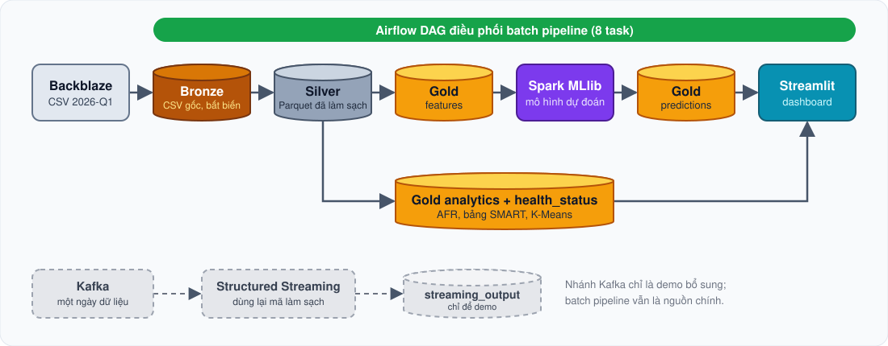

<p align="center">
  
</p>

<p align="center">
  
  
  
  
  
</p>
<p align="center">
  
  
  
  
  
</p>

<p align="center">
  <a href="README.md">English</a> · <b>Tiếng Việt</b>
</p>

<p align="center">
  <a href="#at-a-glance">Tổng quan nhanh</a> ·
  <a href="#review">Xem nhanh trong 5 phút</a> ·
  <a href="#architecture">Kiến trúc</a> ·
  <a href="#results">Kết quả</a> ·
  <a href="#dashboard">Dashboard</a> ·
  <a href="#quick-start">Chạy thử</a> ·
  <a href="#limitations">Giới hạn</a> ·
  <a href="#author">Tác giả</a>
</p>

> [!NOTE]
> Hệ thống Big Data hoàn chỉnh trên dữ liệu công khai **Backblaze Drive Stats**. CSV gốc được lưu trong **HDFS**, làm sạch và phân tích bằng **PySpark / Spark SQL**, chấm điểm bằng **Spark MLlib** và hiển thị trên dashboard **Streamlit**. Toàn bộ chạy trên một máy bằng Docker Compose.

<a id="at-a-glance"></a>

## ⚡ Tổng quan nhanh

<table align="center">
  <tr>
    <td align="center"><h3>30,6 triệu</h3>ổ-ngày<br><sub>2026-Q1, 90 ngày</sub></td>
    <td align="center"><h3>351 nghìn</h3>ổ cứng<br><sub>1.030 lượt hỏng</sub></td>
    <td align="center"><h3>74×</h3>tỷ lệ hỏng của 🔴 Nguy hiểm<br><sub>so với 🟢 Khỏe (7 ngày)</sub></td>
    <td align="center"><h3>21,6×</h3>quét dữ liệu nhanh hơn<br><sub>Parquet so với CSV, cả quý</sub></td>
    <td align="center"><h3>241</h3>test đạt<br><sub>chạy trong container</sub></td>
  </tr>
</table>

| # | Đầu ra | Nội dung |
|:-:|---|---|
| 1 | 📈 **Phân tích chỉ số S.M.A.R.T.** | Tỷ lệ hỏng hằng năm (AFR) theo hãng và model, phân phối ổ hỏng so với ổ khỏe, tín hiệu trước khi hỏng, phân cụm K-Means |
| 2 | 🩺 **Đánh giá tình trạng** | Mỗi ổ mỗi ngày là 🟢 *Khỏe* / 🟡 *Cần theo dõi* / 🔴 *Nguy hiểm*, kèm lý do (chỉ số nào kích hoạt luật) |
| 3 | 🎯 **Dự đoán hỏng** | Điểm rủi ro ổ hỏng trong **7 ngày tới** và danh sách cảnh báo **Top-100** mỗi ngày |

<a id="review"></a>

## 🧭 Xem nhanh trong 5 phút

| Nếu bạn muốn… | Hãy xem |
|---|---|
| **Nhìn thấy sản phẩm** | [Ảnh dashboard](#dashboard) bên dưới, hoặc chạy thử (khoảng 3 lệnh, [Chạy thử](#quick-start)) |
| **Kiểm tra con số** | [`docs/evaluation.md`](docs/evaluation.md) và các bản chụp báo cáo trong [`docs/results/`](docs/results/README.md) |
| **Kiểm tra độ chặt chẽ** | [`tests/test_leakage.py`](tests/test_leakage.py) và [`tests/test_labels.py`](tests/test_labels.py): chia theo thời gian, đặc trưng không dùng dữ liệu tương lai, xử lý right-censoring |
| **Xem điều phối** | [`dags/smart_drive_pipeline_dag.py`](dags/smart_drive_pipeline_dag.py): 8 task, đã chạy xanh trong 37 phút ([sơ đồ](docs/images/airflow_graph.png)) |
| **Xem streaming** | [`docs/results/streaming_demo.md`](docs/results/streaming_demo.md): 338.760 message qua Kafka, đối chiếu khớp với Silver |
| **Xem hiệu năng** | [`docs/results/benchmark.md`](docs/results/benchmark.md): CSV so với Parquet, 1 so với 2 executor, file nhỏ |

<a id="architecture"></a>

## 🏗 Kiến trúc

<p align="center"></p>

> [!IMPORTANT]
> Batch pipeline (Bronze → Silver → Gold) là nguồn cho phân tích và huấn luyện. Kafka chỉ là lớp **trình diễn** gần thời gian thực bổ sung, không thay thế batch pipeline.

**Cụm (Docker Compose):** 1 NameNode, 3 DataNode (replication 2, Bronze 1), 1 Spark master, 2 Spark worker (mỗi worker 2 core, 2 GiB), Streamlit, cùng hai profile tùy chọn `streaming` (ZooKeeper + Kafka) và `orchestration` (Airflow). Cấu hình trung tâm: `config/project.yaml`. Chi tiết: [`docs/service-architecture.md`](docs/service-architecture.md).

### Các lớp dữ liệu

| Lớp | Đường dẫn HDFS | Định dạng | Nội dung |
|---|---|---|---|
| 🟤 **Bronze** | `/smart-drive/bronze/year=…/quarter=…/` | CSV, bất biến | File Backblaze theo ngày, 197 cột |
| ⚪ **Silver** | `/smart-drive/silver/daily` | Parquet, theo `date` | `date`, `serial_number`, `model`, `manufacturer`, `capacity_bytes`, `failure` + 8 cột SMART thô; khóa duy nhất `(serial_number, date)` |
| 🟡 **Gold `features`** | `/smart-drive/gold/features` | Parquet, theo `date` | 90 đặc trưng, nhãn `fail_within_7_days`, `split` (train / val / test) |
| 🟡 **Gold `health_status`** | `/smart-drive/gold/health_status` | Parquet, theo `date` | `health_level`, `reasons[]`, `rules_version` |
| 🟡 **Gold `predictions`** | `/smart-drive/gold/predictions` | Parquet, theo `date` | `risk_score`, `risk_rank`, `alert` (Top-K), `model_version` |
| 🟡 **Gold `analytics`** | `/smart-drive/gold/analytics/` | Parquet | AFR theo model / hãng, phân phối SMART, tín hiệu trước khi hỏng, các bảng K-Means |
| 🟣 **Model** | `/smart-drive/models/v20260930-1/` | Spark ML pipeline | Logistic Regression + `feature_list.json`, `threshold.json`, `metrics.json` |

### Chín bước của môn học → nơi thực hiện

| # | Bước | Cách thực hiện |
|:-:|---|---|
| 1 | Chuẩn bị HDFS | `docker-compose.yml`; cấu trúc Bronze / Silver / Gold dưới `/smart-drive` ([khởi động nhanh](docs/quick-start.md), mục 3) |
| 2 | Upload dữ liệu | `scripts/upload_to_hdfs.py`, `ingestion/hdfs_loader.py`, `ingestion/dataset_validator.py`; kiểm tra bằng `scripts/verify_bronze.py` |
| 3 | Đọc bằng Spark | `processing/spark_jobs/smart_etl.py`: đọc CSV Bronze từ HDFS với `header=true`, không `inferSchema`, nên mọi cột vào dưới dạng chuỗi và được ép kiểu tường minh ở bước 4 |
| 4 | Làm sạch | `smart_etl.py`: ép kiểu tường minh, xử lý null, khử trùng theo (serial, date), ghi Silver Parquet theo ngày; `smart_cleaning.py`: kiểm tra chất lượng (khóa trùng, giá trị bất hợp lý, ngày thiếu) |
| 5 | Spark SQL | `spark.sql` trên view tạm ở đúng năm file: `analytics/build_analytics.py` (AFR, phân phối SMART, tín hiệu trước khi hỏng), `failure_analysis.py`, `drive_model_analysis.py`, `kmeans_segmentation.py`, `export_dashboard.py`. Luật `rules_v1` trong `health_status.py` và các hàm trong `smart_analysis.py` viết bằng DataFrame API; phân bố ba mức tình trạng được đếm bằng SQL trong `export_dashboard.py` |
| 6 | Phân tích nâng cao | `analytics/kmeans_segmentation.py` (K-Means theo hành vi SMART); `ml/train.py`, `ml/evaluate.py` (Logistic Regression, Random Forest) |
| 7 | Lưu kết quả | Các bảng Gold (Parquet trên HDFS); bảng cho dashboard do `analytics/export_dashboard.py` xuất ra |
| 8 | Kafka ingest | `ingestion/kafka_producer.py`, `pipeline/streaming_consumer.py`, `scripts/run_streaming_demo.py` |
| 9 | Airflow DAG | `dags/smart_drive_pipeline_dag.py` (8 task tuần tự), `Dockerfile.airflow` |

<p align="center"></p>

<a id="results"></a>

## 📊 Kết quả

> [!NOTE]
> Mọi con số lấy từ lần chạy thật trên 2026-Q1 và từ các báo cáo trong [`docs/results/`](docs/results/README.md) hoặc [`docs/evaluation.md`](docs/evaluation.md). Chia tập **theo thời gian**: train 2026-01-31 → 03-03, validation 03-04 → 03-14, test 03-15 → 03-31. Tập test được đánh giá **đúng một lần**, sau khi đã chọn mô hình trên validation.

### 🩺 Dữ liệu và đánh giá tình trạng

| | |
|---|---|
| Silver | **30.597.484** ổ-ngày, **0** khóa trùng, 1.030 lượt hỏng, 350.065 ổ chưa từng hỏng |
| AFR toàn quý | **1,23 %** (quy đổi năm từ 90 ngày). HGST 2,87 %, Seagate 1,47 %, Toshiba 1,05 %, Western Digital 0,64 % |
| Bộ luật `rules_v1` | Dùng `smart_5`, `smart_187`, `smart_197`, `smart_198` (ngưỡng ở bên dưới) |

| Mức | Tỷ lệ ổ-ngày | Tỷ lệ hỏng thật trong 7 ngày sau | So với Khỏe |
|---|--:|--:|--:|
| 🟢 Khỏe | 93,42 % | 0,0062 % | 1× |
| 🟡 Cần theo dõi | 3,82 % | 0,0473 % | ≈ 7,6× |
| 🔴 Nguy hiểm | 2,76 % | 0,4597 % | **≈ 74×** |

<details>
<summary><b>Ngưỡng của <code>rules_v1</code></b> (chọn từ dữ liệu, không đoán)</summary>

| Mức | Điều kiện |
|---|---|
| 🟢 **Khỏe** | `smart_5`, `smart_187`, `smart_197` và `smart_198` đều bằng `0` |
| 🟡 **Cần theo dõi** | đúng một trong bốn chỉ số `> 0` |
| 🔴 **Nguy hiểm** | từ hai chỉ số trở lên `> 0` cùng ngày, **hoặc** một chỉ số đạt ngưỡng nghiêm trọng: `smart_5 ≥ 102`, `smart_187 ≥ 40`, `smart_197 ≥ 16`, `smart_198 ≥ 8` (phân vị 99 của nhóm ổ khỏe) |

`smart_9` (giờ bật máy), `smart_194` (nhiệt độ) và `smart_199` (lỗi CRC) **không** được dùng: chúng không phân biệt được ổ sắp hỏng trong dữ liệu này. Nếu chỉ dùng "`> 0`" của `smart_5` làm mức *Nguy hiểm* thì sẽ báo động nhầm 5,4 % ổ khỏe, vượt xa năng lực kiểm tra 100 ổ mỗi ngày.

</details>

### 🧩 Phân cụm K-Means (mô tả)

K = 3 chọn theo silhouette (0,6870) **sau khi** tách nhóm `zero_signal` (cả bốn chỉ số bằng 0).

| Cụm | Số ổ | Số ổ hỏng | Tỷ lệ hỏng | Đặc điểm |
|:-:|--:|--:|--:|---|
| 0 · `zero_signal` | 326.241 | 239 | 0,07 % | không có tín hiệu ở bốn chỉ số |
| 1 | 18.828 | 207 | 1,10 % | tín hiệu nhẹ |
| 2 | 1.846 | 124 | 6,72 % | nhiều sector bị cấp phát lại (`smart_5`) |
| 3 | 4.020 | 300 | 7,46 % | sector chờ xử lý / lỗi offline (`smart_197`, `smart_198`) |

<sub>Phân cụm dùng đúng bốn chỉ số của bộ luật nên sự khớp với các mức tình trạng một phần là do cách định nghĩa. Đây là mô tả, không phải kiểm chứng độc lập. Nguồn: [`kmeans_segmentation.md`](docs/results/kmeans_segmentation.md).</sub>

<p align="center"></p>

### 🎯 Dự đoán hỏng

**Mô hình:** Logistic Regression, chọn trên validation. **Chỉ số:** recall và precision trong Top-100 ổ mỗi ngày. 90 đặc trưng (8 giá trị SMART, 8 cờ thiếu giá trị, 72 đặc trưng cửa sổ 7 / 14 / 30 ngày, 2 chỉ số mã hóa nhóm).

| Tập | Phương pháp | Recall@100 | Precision@100 |
|---|---|--:|--:|
| Validation | **Logistic Regression** | **9,21 %** | **10,27 %** |
| Validation | Baseline `rules_v1` | 1,64 % | 1,73 % |
| Test, đoạn `normal` (03-15 → 03-24) | **Logistic Regression** | **5,55 %** | **3,80 %** |
| Test, đoạn `normal` | Baseline `rules_v1` | 3,47 % | 2,40 % |

> [!IMPORTANT]
> **Cách đọc số trên test.** Bảy ngày cuối của dữ liệu bị cắt phải (right-censoring): chỉ còn các dòng của ổ đã biết chắc sẽ hỏng, nên *phương pháp nào* cũng đạt điểm cao một cách tầm thường ở đó. Vì vậy kết quả test chỉ được báo cáo trên **đoạn `normal`** (99,99 % số dòng test); lập luận nằm ở mục 3 của [`docs/evaluation.md`](docs/evaluation.md). Trong Top-100, mô hình tìm được nhiều hơn baseline luật khoảng **5,6 lần** trên validation và khoảng **1,6 lần** trên đoạn `normal` của test. PR-AUC thấp (0,0245 trên validation) vì nhãn dương cực hiếm (≈ 0,02 % số dòng).

> [!NOTE]
> `risk_score` là **điểm xếp hạng** của mô hình có trọng số lớp, không phải xác suất đã hiệu chỉnh. Nhiều ổ bão hòa ở 1,0 nên khi hòa điểm sẽ xếp theo margin của mô hình, và recall@100 phụ thuộc cách chia hòa (9,21 % so với 9,06 % trên validation).

<p align="center"></p>

### ⚡ Hiệu năng và streaming

Trung vị của 3 lần chạy trên một laptop (Ryzen 5 6600H, 15,2 GB RAM, Docker 7,36 GiB). Nguồn: [`benchmark.md`](docs/results/benchmark.md), [`pipeline_run_2026-10-03.md`](docs/results/pipeline_run_2026-10-03.md), [`streaming_demo.md`](docs/results/streaming_demo.md).

| Thí nghiệm | Kết quả |
|---|---|
| 🗜 **Silver Parquet so với CSV gốc**, cả quý, cùng truy vấn `count + groupBy(model)` | **2,13 giây so với 46,04 giây** (nhanh hơn 21,6 lần); 287 MB so với 11,2 GB |
| 📦 **File nhỏ**: Gold features từ 540 xuống 60 file | 3,54 giây → 1,39 giây (2,55×) |
| 🧮 **1 so với 2 executor**, CSV 7 ngày | 7,52 giây → 4,59 giây; trên Silver Parquet chênh lệch nhỏ (2,62 giây → 2,41 giây) vì thời gian khởi động chiếm phần lớn |
| 🔁 **Chạy trọn vẹn**, 2026-10-03 | Silver 200 giây · analytics 314 giây · health status 91 giây · features 275 giây · huấn luyện 629 giây · chấm điểm 31 giây (342.662 dòng) |
| 🌀 **Demo Kafka**, một ngày (2026-01-01) | 338.760 message được gửi, xác nhận và ghi; số dòng, số serial và số lượt hỏng **khớp với Silver**; RAM Docker đỉnh 4,75 GiB trên 7,36 GiB |
| 🗓 **Airflow DAG**, 8 task | tất cả xanh trong 37 phút |

<p align="center"></p>

<a id="dashboard"></a>

## 🖥 Dashboard

Năm trang, chỉ đọc các bảng nhỏ đã xuất sẵn. Trang nào thiếu bảng sẽ hướng dẫn cách tạo thay vì báo lỗi.

<table>
  <tr>
    <td width="50%"><b>Tổng quan</b><br></td>
    <td width="50%"><b>Phân tích chỉ số S.M.A.R.T.</b><br></td>
  </tr>
  <tr>
    <td width="50%"><b>Tình trạng ổ cứng + K-Means</b><br></td>
    <td width="50%"><b>Dự đoán hỏng (Top-100)</b><br></td>
  </tr>
</table>

<a id="quick-start"></a>

## 🚀 Chạy thử

> [!WARNING]
> Cấp cho Docker **ít nhất 7,5 GiB** RAM (máy nên có 16 GB). Chạy các job Spark **từng cái một**. Trên laptop 8 GB hãy giảm `SPARK_WORKER_MEMORY` và `SPARK_WORKER_CORES` trong `.env` trước.

**Yêu cầu:** Windows 11 với WSL2 + Docker Desktop (Compose v2); ổ đĩa trống cho CSV gốc (11,2 GB mỗi quý) cộng bản sao HDFS; Python 3 trên máy chỉ để chạy vài script nhỏ (`pip install pyyaml requests`). Job Spark và test chạy trong container.

**Dữ liệu:** [Backblaze Drive Stats](https://www.backblaze.com/cloud-storage/resources/hard-drive-test-data), quý 2026-Q1 (`data_Q1_2026.zip`). Ghi nguồn Backblaze, không phân phối lại hay bán bộ dữ liệu, và đọc điều khoản trên trang tải (điều khoản đó được ưu tiên hơn phần tóm tắt này). Dữ liệu **không** nằm trong repo.

**1 · Khởi động cụm**

```bash
cp .env.example .env            # PowerShell: Copy-Item .env.example .env
docker compose up -d --build
docker compose ps               # NameNode, 3 DataNode, Spark master, 2 worker, ui-dashboard
```

NameNode UI → http://localhost:9870 · Spark master UI → http://localhost:8080

**2 · Lấy dữ liệu và nạp Bronze**

```bash
python scripts/download_dataset.py            # tải data_Q1_2026.zip vào dataset/raw/; giải nén ra
```

Trong `docker-compose.yml`, service `namenode` mount thư mục chứa các file CSV đã giải nén ở chế độ chỉ đọc vào `/external_data` (vế trái của volume `:/external_data:ro`). Hãy sửa vế trái thành thư mục của bạn, rồi:

```bash
docker compose config > /dev/null && docker compose up -d namenode
python scripts/upload_to_hdfs.py --host-source-dir <thu-muc-chua-csv-tren-may> \
  --container-source-dir /external_data/<thu-muc-con> --start-date 2026-01-01 --end-date 2026-03-31
python scripts/verify_bronze.py               # mã thoát 0 khi đủ mọi ngày
```

**3 · Chạy các pipeline** (job Spark chạy trong `spark-master`)

```bash
SUBMIT="docker compose exec -e PYTHONPATH=/opt/smart-drive spark-master /opt/spark/bin/spark-submit --master spark://spark-master:7077"
$SUBMIT /opt/smart-drive/scripts/run_batch_pipeline.py       # Bronze -> Silver -> analytics, health_status, features
$SUBMIT /opt/smart-drive/scripts/run_training_pipeline.py    # huấn luyện + đánh giá chỉ trên validation
$SUBMIT /opt/smart-drive/scripts/run_scoring_pipeline.py --date 2026-03-24   # Gold predictions
```

`run_batch_pipeline.py --steps silver_etl,analytics,health_status,features` chọn bước cần chạy. Mỗi lần chạy ghi log vào `artifacts/reports/pipeline_run_<ngày>.md`.

**4 · K-Means, bảng cho dashboard, dashboard**

```bash
$SUBMIT /opt/smart-drive/analytics/kmeans_segmentation.py    # khoảng 8-12 phút
$SUBMIT /opt/smart-drive/analytics/export_dashboard.py       # cần Gold predictions
docker compose restart ui-dashboard                          # http://localhost:8501
```

<details>
<summary><b>Hoặc chạy tất cả bằng Airflow</b> (DAG <code>smart_drive_pipeline</code>, 8 task, kích hoạt thủ công)</summary>

Đặt `AIRFLOW_ADMIN_PASSWORD` trong `.env` trước (mật khẩu của riêng bạn; không bao giờ commit `.env`).

```bash
docker compose --profile orchestration build
docker compose stop ui-dashboard                       # giải phóng RAM
docker compose --profile orchestration up -d           # giao diện: http://127.0.0.1:8081
docker compose exec airflow-scheduler airflow dags trigger smart_drive_pipeline
```

Nạp Bronze vẫn là bước thủ công; DAG chỉ **kiểm tra** Bronze. `train_model` chỉ huấn luyện và đánh giá trên train/validation, không bao giờ chạm tập test.

</details>

<details>
<summary><b>Demo Kafka</b> (một ngày dữ liệu; đóng ứng dụng nặng trước và dừng <code>ui-dashboard</code>)</summary>

```bash
python -m venv .venv-kafka
.venv-kafka/Scripts/python -m pip install -r requirements-streaming.txt   # Linux/macOS: .venv-kafka/bin/python
.venv-kafka/Scripts/python scripts/run_streaming_demo.py --host-source-dir <thu-muc-chua-csv-tren-may> \
  --dates 2026-01-01 --start-kafka --stop-kafka
```

Báo cáo được ghi vào `artifacts/reports/streaming_demo.md`. `--stop-kafka` chỉ dừng ZooKeeper và Kafka, không xóa gì.

</details>

<details>
<summary><b>Benchmark và test</b></summary>

Benchmark cần cụm đang rảnh; trình tự lệnh đầy đủ ở mục 9 của [`docs/quick-start.md`](docs/quick-start.md). Test chạy trong container:

```bash
docker compose run --rm tests python3 -m pytest -q
```

</details>

> [!CAUTION]
> Dừng hệ thống bằng `docker compose down`, lệnh này giữ lại các volume HDFS. **Không thêm `-v`** trừ khi bạn muốn xóa toàn bộ dữ liệu HDFS.

### Xử lý sự cố

| Triệu chứng | Cách xử lý |
|---|---|
| Một trang dashboard báo thiếu bảng | Chạy các lệnh xuất ở bước 4; trang sẽ hiện đúng lệnh cần chạy |
| Airflow init dừng và nhắc về mật khẩu | Đặt `AIRFLOW_ADMIN_PASSWORD` trong `.env` |
| Một job Spark bị từ chối ("đang có ứng dụng khác chạy") | Đợi job đang chạy xong; cơ chế bảo vệ chỉ cho một job Spark mỗi lần (RAM là giới hạn) |
| Client trên máy không kết nối được Kafka | Dùng `127.0.0.1:9092` (broker chỉ được mở trên 127.0.0.1) |
| "Page not found" sau khi tải lại một trang con của dashboard | Mở `http://localhost:8501` rồi chọn trang ở thanh bên |
| Cổng đã bị chiếm | Đổi biến cổng trong `.env` (tên biến ở bên dưới) |

## 🗂 Cấu trúc thư mục và biến môi trường

<details>
<summary><b>Cấu trúc thư mục</b></summary>

```text
config/                 cấu hình trung tâm (project.yaml), cấu hình HDFS
ingestion/              tải, kiểm tra, nạp Bronze, Kafka producer
processing/spark_jobs/  Bronze -> Silver (làm sạch), profiling schema
features/               nhãn 7 ngày và đặc trưng cửa sổ
ml/                     huấn luyện, đánh giá, chấm điểm
analytics/              phân tích SMART, tình trạng ổ, K-Means, xuất bảng dashboard, benchmark
pipeline/               pipeline batch, huấn luyện, chấm điểm, streaming consumer, đặc tả DAG
dags/                   Airflow DAG
scripts/                điểm vào (batch, huấn luyện, chấm điểm, demo streaming, benchmark, kiểm tra)
ui_dashboard/           ứng dụng Streamlit (app.py, views/)
tests/                  unit test trên fixture nhỏ (không cần cụm)
docs/                   khởi động nhanh, kiến trúc, đánh giá, bản chụp kết quả, ảnh
artifacts/              báo cáo và bảng dashboard sinh ra (git không theo dõi)
```

</details>

<details>
<summary><b>Biến môi trường</b> (chỉ liệt kê tên; giá trị mặc định ở <code>.env.example</code>)</summary>

| Biến | Dùng cho |
|---|---|
| `HDFS_REPLICATION_FACTOR` | Số bản sao HDFS |
| `NAMENODE_WEB_PORT`, `NAMENODE_RPC_PORT` | Cổng NameNode |
| `SPARK_MASTER_WEB_PORT`, `SPARK_MASTER_PORT` | Cổng Spark master |
| `SPARK_WORKER_MEMORY`, `SPARK_WORKER_CORES` | Tài nguyên Spark worker |
| `DASHBOARD_PORT` | Cổng Streamlit |
| `AIRFLOW_WEB_PORT`, `AIRFLOW_ADMIN_PASSWORD` | Cổng giao diện Airflow và tài khoản quản trị |
| `KAFKA_PORT` | Cổng Kafka (chỉ mở trên 127.0.0.1) |

</details>

<details>
<summary><b>Cách chống leakage</b></summary>

- Chia tập **theo ngày**, không bao giờ ngẫu nhiên: train 01-31 → 03-03, validation 03-04 → 03-14, test 03-15 → 03-31 (không chồng nhau). 30 ngày đầu là giai đoạn khởi động cho các cửa sổ trượt.
- Đặc trưng của ngày *t* chỉ dùng dữ liệu đến ngày *t*; `serial_number` và cờ `failure` hiện tại không bao giờ là đặc trưng; bộ mã hóa nhóm chỉ fit trên train.
- Các dòng sau ngày ổ hỏng bị loại; cửa sổ vượt qua cuối dữ liệu bị right-censoring (loại) trừ khi ổ đã được quan sát là hỏng.
- [`tests/test_leakage.py`](tests/test_leakage.py) đổi dữ liệu sau ngày *t* và kiểm tra đặc trưng của ngày *t* không đổi, không có cột bị cấm và các giai đoạn chia tập không chồng nhau.

</details>

<a id="limitations"></a>

## ⚠ Giới hạn

- **Chỉ một quý** dữ liệu (2026-Q1, 90 ngày). Ngưỡng của luật và mô hình đều học từ chính quý này nên có thể không tổng quát.
- **Nhãn dương cực hiếm** (≈ 0,02 % số dòng): PR-AUC thấp và recall@100 ở mức khiêm tốn (5,55 % trên đoạn `normal` của test).
- **Khoảng một phần tư ổ hỏng không có tín hiệu** ở bốn chỉ số: 27,5 % (239 trên 870) ở ngày liền trước khi hỏng, 26,4 % (244 trên 923) trong 7 ngày, 24,0 % (241 trên 1.003) trong 30 ngày; mẫu số khác nhau theo từng cửa sổ ([`docs/evaluation.md`](docs/evaluation.md), mục 5.1).
- **Random Forest không tái lập:** huấn luyện lại trên cùng cách chia cho kết quả khác, nên Logistic Regression là mô hình chính thức.
- Bảy ngày cuối bị right-censoring nên số đo test chỉ báo cáo trên đoạn `normal`.
- Hãng sản xuất được suy từ tiền tố tên model bằng quy tắc trong code, không phải trường gốc của Backblaze.
- Benchmark và cấu hình Airflow (SQLite, sequential executor) chỉ là minh họa trên một máy. Demo Kafka phát lại một ngày dữ liệu có sẵn, không phải nguồn dữ liệu trực tiếp.

**Hướng phát triển:** thêm nhiều quý với đánh giá cuốn chiếu · phân tích từng ca bỏ sót · hiệu chỉnh xác suất, tinh chỉnh Random Forest · DAG có lịch với executor cho môi trường thật và chấm điểm nhận dữ liệu từ nhánh streaming.

<a id="author"></a>

## 👤 Tác giả

<table>
  <tr>
    <td width="120" align="center"><a href="https://github.com/hongquocAI"></a></td>
    <td>
      <b>Lê Hồng Quốc</b><br>
      Xây dựng hệ thống từ đầu đến cuối: các lớp dữ liệu trên HDFS, pipeline Spark, mô hình, dashboard, Airflow và Kafka.<br>
      <a href="https://github.com/hongquocAI"></a>
    </td>
  </tr>
</table>

<details>
<summary><b>Điều tôi học được</b></summary>

- Thiết kế các lớp **Bronze / Silver / Gold** trên HDFS với hợp đồng dữ liệu tường minh giữa các lớp.
- Chống **leakage** khi gán nhãn chuỗi thời gian: chia theo thời gian, right-censoring, đặc trưng chỉ nhìn về quá khứ.
- Đánh giá **trung thực** khi nhãn dương chỉ chiếm 0,02 % số dòng: đọc chỉ số theo từng đoạn, nêu rõ baseline đã đạt được gì, đo ảnh hưởng của cách chia hòa điểm.
- **Điều phối** bằng Airflow và kiểm chứng demo Kafka bằng cách đối chiếu với kết quả batch thay vì tin vào nó.
- **Đo đạc** thay vì đoán: CSV so với Parquet, executor, file nhỏ, giới hạn bộ nhớ.

</details>

## 📄 Giấy phép và ghi nhận

Mã nguồn: [MIT](LICENSE) © 2026 Lê Hồng Quốc and contributors. Bộ dữ liệu **không** được đi kèm và giữ nguyên điều khoản của Backblaze.

Cảm ơn **Backblaze** đã công bố Drive Stats, và Reuben Khang Nguyen đã tạo bộ khung ban đầu của repository.
