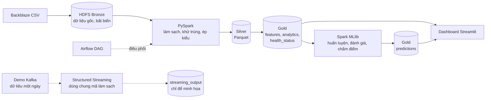

# SMART Drive Failure

**Phân tích dữ liệu S.M.A.R.T. và dự đoán nguy cơ hỏng ổ cứng trong 7 ngày bằng Apache Spark.**

Hệ thống Big Data hoàn chỉnh trên dữ liệu công khai Backblaze Drive Stats (2026-Q1, 30,6 triệu dòng ổ-ngày, 1.030 lượt hỏng). CSV gốc được lưu trong HDFS, làm sạch và phân tích bằng PySpark và Spark SQL, chấm điểm bằng Spark MLlib và trình bày trên dashboard Streamlit. Toàn bộ chạy trên một máy bằng Docker Compose.

Bản tiếng Anh: [README.md](README.md).


## Mục lục

1. [Ba đầu ra](#1-ba-đầu-ra)
2. [Kiến trúc](#2-kiến-trúc)
3. [Kết quả](#3-kết-quả)
4. [Yêu cầu máy và dữ liệu](#4-yêu-cầu-máy-và-dữ-liệu)
5. [Chạy từ repo trống](#5-chạy-từ-repo-trống)
6. [Cấu trúc thư mục và biến môi trường](#6-cấu-trúc-thư-mục-và-biến-môi-trường)
7. [Giới hạn và hướng phát triển](#7-giới-hạn-và-hướng-phát-triển)

## 1. Ba đầu ra

| # | Đầu ra | Vị trí |
|---|---|---|
| 1 | **Phân tích chỉ số S.M.A.R.T.**: tỷ lệ hỏng hằng năm (AFR) theo hãng và model, phân phối ổ khỏe so với ổ hỏng, tín hiệu trước khi hỏng, phân cụm K-Means | `analytics/`, Gold `analytics`, trang dashboard *Phân tích SMART* và *Tình trạng ổ cứng* |
| 2 | **Đánh giá tình trạng** từng ổ theo ngày: *Khỏe / Cần theo dõi / Nguy hiểm*, kèm lý do (chỉ số nào kích hoạt luật) | Gold `health_status`, bộ luật `rules_v1` |
| 3 | Đọc bằng Spark | `processing/spark_jobs/smart_etl.py`: Spark đọc CSV Bronze từ HDFS với `header=true` và không dùng `inferSchema`, nên mọi cột vào dưới dạng chuỗi và được ép kiểu tường minh ở bước 4 |

## 2. Kiến trúc



Batch pipeline (Bronze → Silver → Gold) là nguồn dữ liệu chính cho phân tích và huấn luyện. Kafka chỉ là lớp trình diễn gần thời gian thực bổ sung, không thay thế batch.

Cụm (Docker Compose): 1 NameNode, 3 DataNode (nhân bản HDFS 2; Bronze 1), 1 Spark master, 2 Spark worker (mỗi worker 2 core, 2 GiB), dịch vụ Streamlit, và hai profile tùy chọn: `streaming` (ZooKeeper + Kafka), `orchestration` (Airflow). Cấu hình trung tâm: `config/project.yaml`. Chi tiết: [docs/service-architecture.md](docs/service-architecture.md).

### Chín bước của môn học và nơi thực hiện

| # | Bước | Thực hiện |
|---|---|---|
| 1 | Chuẩn bị HDFS | `docker-compose.yml`; cấu trúc Bronze/Silver/Gold dưới `/smart-drive` ([docs/quick-start.md](docs/quick-start.md), mục 3) |
| 2 | Upload dữ liệu | `scripts/upload_to_hdfs.py`, `ingestion/hdfs_loader.py`, `ingestion/dataset_validator.py`; kiểm tra bằng `scripts/verify_bronze.py` |
| 3 | Đọc bằng Spark | `processing/spark_jobs/smart_etl.py`: Spark đọc CSV Bronze từ HDFS với `header=true` và không dùng `inferSchema`, nên mọi cột vào dưới dạng chuỗi và được ép kiểu tường minh ở bước 4 |
| 4 | Làm sạch dữ liệu | `processing/spark_jobs/smart_etl.py`: ép kiểu tường minh, xử lý null, khử trùng theo (serial, ngày), ghi Silver Parquet phân vùng theo ngày; `smart_cleaning.py`: các phép kiểm tra chất lượng dữ liệu (khóa trùng, giá trị bất hợp lý, ngày thiếu) |
| 5 | Spark SQL | `spark.sql` trên view tạm ở đúng năm file: `analytics/build_analytics.py` (AFR, phân phối SMART, tín hiệu trước khi hỏng), `failure_analysis.py`, `drive_model_analysis.py`, `kmeans_segmentation.py`, `export_dashboard.py`. Luật `rules_v1` trong `analytics/health_status.py` và các hàm trong `analytics/smart_analysis.py` viết bằng DataFrame API; phân bố ba mức tình trạng được đếm bằng SQL trong `export_dashboard.py` |
| 6 | Phân tích nâng cao / phân cụm | `analytics/kmeans_segmentation.py` (K-Means theo hành vi SMART); `ml/train.py`, `ml/evaluate.py` (Logistic Regression và Random Forest) |
| 7 | Lưu kết quả | Bảng Gold `features`, `analytics`, `health_status`, `predictions` (Parquet trên HDFS); bảng cho dashboard xuất bởi `analytics/export_dashboard.py` |
| 8 | Kafka ingest | `ingestion/kafka_producer.py`, `pipeline/streaming_consumer.py`, `scripts/run_streaming_demo.py` |
| 9 | Airflow DAG | `dags/smart_drive_pipeline_dag.py` (8 task tuần tự), `Dockerfile.airflow` |


## 3. Kết quả

Mọi con số dưới đây đến từ lần chạy thật trên 2026-Q1 và từ các báo cáo trong [`docs/results/`](docs/results/README.md) hoặc [`docs/evaluation.md`](docs/evaluation.md). Chia tập theo thời gian: train 2026-01-31 → 03-03, validation 03-04 → 03-14, test 03-15 → 03-31. Tập test chỉ được đánh giá đúng một lần, sau khi đã chọn model trên validation.

### Dữ liệu và đánh giá tình trạng

Nguồn: [`eda_summary.md`](docs/results/eda_summary.md), [`health_baseline.md`](docs/results/health_baseline.md), [`data_quality.md`](docs/results/data_quality.md).

- Silver: 30.597.484 dòng ổ-ngày, 0 khóa trùng; 1.030 lượt hỏng; 350.065 ổ chưa từng hỏng; AFR toàn quý 1,23% (quy năm từ 90 ngày).
- Bộ luật `rules_v1` (smart_5, smart_187, smart_197, smart_198) cho Khỏe 93,42%, Cần theo dõi 3,82%, Nguy hiểm 2,76% số dòng ổ-ngày. Tỷ lệ hỏng thực tế trong 7 ngày sau tăng theo mức: 0,0062% (Khỏe), 0,0473% (Cần theo dõi, gấp khoảng 7,6 lần), 0,4597% (Nguy hiểm, gấp khoảng 74 lần).
- K-Means ([`kmeans_segmentation.md`](docs/results/kmeans_segmentation.md)): chọn K = 3 theo silhouette (0,6870) sau khi tách nhóm `zero_signal` (326.241 ổ có cả bốn chỉ số bằng 0). Phân cụm mang tính mô tả, không phải kiểm chứng độc lập cho bộ luật, vì dùng cùng bốn chỉ số.


### Dự đoán ổ hỏng

Mô hình: Logistic Regression (chọn trên validation). Thước đo: recall và precision trong Top-100 ổ mỗi ngày. Nguồn: [`docs/evaluation.md`](docs/evaluation.md), mục 1 và 3.

| Tập | Phương pháp | Recall@100 | Precision@100 |
|---|---|---|---|
| Validation | **Logistic Regression** | **9,21%** | **10,27%** |
| Validation | Baseline `rules_v1` | 1,64% | 1,73% |
| Test, đoạn `normal` (2026-03-15 → 03-24) | **Logistic Regression** | **5,55%** | **3,80%** |
| Test, đoạn `normal` | Baseline `rules_v1` | 3,47% | 2,40% |

Bảy ngày cuối của dataset (bị cắt phải, right-censoring) chỉ còn dòng của những ổ đã biết chắc sẽ hỏng, nên phương pháp nào cũng đạt điểm tuyệt đối một cách tầm thường ở đó. Vì vậy kết quả test được báo cáo trên đoạn `normal` (99,99% số dòng test); lập luận chi tiết ở mục 3 của tài liệu đánh giá. Trên validation, mô hình bắt được gấp khoảng 5,6 lần số ổ hỏng trong Top-100 so với luật baseline, và gấp khoảng 1,6 lần trên đoạn `normal` của test. PR-AUC thấp (0,0245 trên validation) vì nhãn dương rất hiếm (khoảng 0,02% số dòng).


### Hiệu năng và streaming

Nguồn: [`benchmark.md`](docs/results/benchmark.md), [`pipeline_run_2026-10-03.md`](docs/results/pipeline_run_2026-10-03.md), [`streaming_demo.md`](docs/results/streaming_demo.md). Mọi số đo là trung vị của 3 lần chạy trên một laptop dùng Docker (không phải cụm production).

- Silver Parquet so với CSV gốc trên toàn quý: 2,13 s so với 46,04 s cho cùng truy vấn `count + groupBy(model)` (nhanh gấp 21,6 lần; 287 MB so với 11,2 GB).
- Gộp Gold features từ 540 xuống 60 file: 3,54 s → 1,39 s (gấp 2,55 lần).
- Một executor so với hai trên tác vụ CSV 7 ngày: 7,52 s → 4,59 s; trên Silver Parquet chênh lệch nhỏ (2,62 s → 2,41 s).
- Một lần chạy đầu-cuối ngày 2026-10-03: Silver 200 s, analytics 314 s, health status 91 s, features 275 s, huấn luyện (train + validation) 629 s, chấm điểm 31 s (342.662 dòng).
- Demo Kafka một ngày (2026-01-01): gửi và được xác nhận 338.760 message, Structured Streaming ghi 338.760 dòng; số dòng, số serial và tổng lượt hỏng khớp với phân vùng Silver cùng ngày. Bộ nhớ Docker đỉnh 4,75 GiB trên 7,36 GiB.


## 4. Yêu cầu máy và dữ liệu

- Windows 11 với WSL2 và Docker Desktop (Docker Compose v2).
- Khuyến nghị RAM 16 GB; cấp cho Docker tối thiểu 7,5 GiB. Mọi thời gian chạy ở trên đo với khoảng 7,4 GiB.
- Ổ đĩa trống cho CSV gốc (11,2 GB cho cả quý, theo benchmark) cộng bản sao HDFS và đầu ra Parquet.
- Python 3 trên máy host cho các script nhỏ phía host (`pip install pyyaml requests`). Test và Spark job chạy trong container.

**Dữ liệu.** [Backblaze Drive Stats](https://www.backblaze.com/cloud-storage/resources/hard-drive-test-data), quý 2026-Q1 (`data_Q1_2026.zip`). Dữ liệu do Backblaze công bố; hãy ghi nguồn Backblaze, không phân phối lại hay bán chính bộ dữ liệu, và đọc điều khoản trên trang tải xuống, các điều khoản đó có hiệu lực cao hơn phần tóm tắt này. Dữ liệu không nằm trong repo.

## 5. Chạy từ repo trống

Lệnh dùng cho shell POSIX (Git Bash hoặc WSL). Chi tiết từng job và lưu ý: [docs/quick-start.md](docs/quick-start.md).

**1. Cấu hình và cụm**

```bash
cp .env.example .env            # PowerShell: Copy-Item .env.example .env
docker compose up -d --build
docker compose ps               # NameNode, 3 DataNode, Spark master, 2 worker, ui-dashboard
```

Giao diện NameNode: http://localhost:9870, Spark master: http://localhost:8080. Trên laptop 8 GB hãy hạ `SPARK_WORKER_MEMORY` và `SPARK_WORKER_CORES` trong `.env` trước.

**2. Lấy dữ liệu và nạp Bronze**

```bash
python scripts/download_dataset.py            # tải data_Q1_2026.zip vào dataset/raw/; giải nén file zip
```

Trong `docker-compose.yml`, service `namenode` mount thư mục chứa các CSV đã giải nén ở chế độ chỉ đọc tại `/external_data` (vế trái của volume `:/external_data:ro`). Hãy trỏ nó tới thư mục của bạn, kiểm tra rồi khởi động lại NameNode:

```bash
docker compose config > /dev/null && docker compose up -d namenode
python scripts/upload_to_hdfs.py --host-source-dir <thư-mục-chứa-csv-trên-host> \
  --container-source-dir /external_data/<thư-mục-con> --start-date 2026-01-01 --end-date 2026-03-31
python scripts/verify_bronze.py               # mã thoát 0 khi đủ dữ liệu từng ngày
```

**3. Pipeline.** Spark job chạy trong `spark-master`:

```bash
SUBMIT="docker compose exec -e PYTHONPATH=/opt/smart-drive spark-master /opt/spark/bin/spark-submit --master spark://spark-master:7077"
$SUBMIT /opt/smart-drive/scripts/run_batch_pipeline.py       # Bronze -> Silver -> analytics, health_status, features
$SUBMIT /opt/smart-drive/scripts/run_training_pipeline.py    # huấn luyện + đánh giá chỉ trên validation
$SUBMIT /opt/smart-drive/scripts/run_scoring_pipeline.py --date 2026-03-24   # Gold predictions
```

`run_batch_pipeline.py --steps silver_etl,analytics,health_status,features` chọn các bước cần chạy. Chạy tuần tự từng Spark job; mỗi lần chạy ghi nhật ký vào `artifacts/reports/pipeline_run_<ngày>.md`.

**Hoặc dùng Airflow** (DAG `smart_drive_pipeline`, 8 task, chạy thủ công). Đặt `AIRFLOW_ADMIN_PASSWORD` trong `.env` trước:

```bash
docker compose --profile orchestration build
docker compose stop ui-dashboard                       # giải phóng bộ nhớ
docker compose --profile orchestration up -d           # giao diện: http://127.0.0.1:8081
docker compose exec airflow-scheduler airflow dags trigger smart_drive_pipeline
```

Nạp Bronze vẫn là bước thủ công; DAG chỉ xác nhận kết quả.

**4. K-Means, bảng cho dashboard và dashboard**

```bash
$SUBMIT /opt/smart-drive/analytics/kmeans_segmentation.py    # khoảng 8-12 phút
$SUBMIT /opt/smart-drive/analytics/export_dashboard.py       # cần Gold predictions
docker compose restart ui-dashboard                          # http://localhost:8501
```

Trang nào thiếu bảng sẽ hiện hướng dẫn tạo bảng đó thay vì báo lỗi.

**5. Demo Kafka** (một ngày dữ liệu; đóng ứng dụng nặng trước và dừng `ui-dashboard`):

```bash
python -m venv .venv-kafka
.venv-kafka/Scripts/python -m pip install -r requirements-streaming.txt   # Linux/macOS: .venv-kafka/bin/python
.venv-kafka/Scripts/python scripts/run_streaming_demo.py --host-source-dir <thư-mục-chứa-csv-trên-host> \
  --dates 2026-01-01 --start-kafka --stop-kafka
```

Báo cáo ghi ở `artifacts/reports/streaming_demo.md`. `--stop-kafka` chỉ dừng ZooKeeper và Kafka, không xóa gì.

**6. Benchmark.** Cần cụm rảnh; chuỗi lệnh chính xác ở mục 9 của [docs/quick-start.md](docs/quick-start.md). Kết quả: `artifacts/reports/benchmark.md` và trang *Hiệu năng cụm*.

**7. Kiểm thử**

```bash
docker compose run --rm tests python3 -m pytest -q
```

**Dừng** bằng `docker compose down`, giữ nguyên volume HDFS. Không dùng `-v` trừ khi muốn xóa toàn bộ dữ liệu HDFS.

## 6. Cấu trúc thư mục và biến môi trường

```text
config/                 cấu hình trung tâm (project.yaml), cấu hình HDFS
ingestion/              tải, kiểm tra, nạp Bronze, Kafka producer
processing/spark_jobs/  Bronze -> Silver (ép kiểu tường minh, làm sạch), profiling schema
features/               nhãn 7 ngày và đặc trưng theo cửa sổ
ml/                     huấn luyện, đánh giá, chấm điểm
analytics/              phân tích SMART, tình trạng ổ, K-Means, xuất dashboard, benchmark
pipeline/               pipeline batch, huấn luyện, chấm điểm, streaming consumer, đặc tả DAG
dags/                   Airflow DAG
scripts/                điểm vào (batch, huấn luyện, chấm điểm, demo streaming, benchmark, kiểm tra)
ui_dashboard/           ứng dụng Streamlit (app.py, views/)
tests/                  unit test trên fixture nhỏ (không cần cụm)
docs/                   khởi động nhanh, kiến trúc, đánh giá, ảnh chụp kết quả, hình ảnh
artifacts/              báo cáo và bảng dashboard sinh ra (git không theo dõi)
```

Biến đọc từ `.env` (chỉ liệt kê tên; giá trị mặc định và chú thích nằm ở `.env.example`):

| Biến | Dùng cho |
|---|---|
| `HDFS_REPLICATION_FACTOR` | Hệ số nhân bản HDFS |
| `NAMENODE_WEB_PORT`, `NAMENODE_RPC_PORT` | Cổng NameNode |
| `SPARK_MASTER_WEB_PORT`, `SPARK_MASTER_PORT` | Cổng Spark master |
| `SPARK_WORKER_MEMORY`, `SPARK_WORKER_CORES` | Tài nguyên Spark worker |
| `DASHBOARD_PORT` | Cổng Streamlit |
| `AIRFLOW_WEB_PORT`, `AIRFLOW_ADMIN_PASSWORD` | Cổng giao diện Airflow và tài khoản admin (tự đặt mật khẩu; không commit `.env`) |
| `KAFKA_PORT` | Cổng Kafka (chỉ publish trên 127.0.0.1) |

## 7. Giới hạn và hướng phát triển

**Giới hạn**

- Chỉ một quý dữ liệu (2026-Q1, 90 ngày). Ngưỡng luật và mô hình học từ chính quý này nên có thể không tổng quát cho giai đoạn khác.
- PR-AUC thấp vì ổ hỏng rất hiếm (khoảng 0,02% số dòng). Recall@100 là thước đo chính; giá trị tuyệt đối khiêm tốn (5,55% trên đoạn `normal` của test).
- Khoảng một phần tư ổ hỏng không có tín hiệu ở bốn chỉ số mà luật và K-Means dùng: 27,5% (239/870) ở ngày liền trước ngày hỏng, 26,4% (244/923) trong 7 ngày, 24,0% (241/1.003) trong 30 ngày. Mẫu số thay đổi theo cửa sổ. Xem [docs/evaluation.md](docs/evaluation.md), mục 5.1.
- Kết quả Random Forest không tái lập được: huấn luyện lại trên cùng tập chia cho metric khác, nên mô hình chính thức là Logistic Regression.
- `risk_score` là điểm rủi ro của mô hình có trọng số lớp, không phải xác suất đã hiệu chỉnh. Chỉ nên diễn giải thứ hạng (Top-K). Nhiều ổ bão hòa ở 1,0 nên recall@100 phụ thuộc cách chia hòa (9,21% so với 9,06% trên validation).
- Bảy ngày cuối dataset bị cắt phải, nên số đo test chỉ được báo cáo trên đoạn `normal`.
- Hãng sản xuất được suy từ tiền tố tên model bằng quy tắc trong code, không phải trường gốc của Backblaze.
- Benchmark và cấu hình Airflow (SQLite, sequential executor) chỉ là minh họa trên một máy. Demo Kafka phát lại một ngày dữ liệu có sẵn, không phải nguồn dữ liệu trực tiếp.

**Hướng phát triển**

- Thêm nhiều quý dữ liệu và đánh giá cuốn chiếu theo thời gian giữa các quý.
- Phân tích từng ca bỏ sót, và dùng thêm các thuộc tính SMART còn lại cho nhóm ổ không có tín hiệu.
- Hiệu chỉnh xác suất cho điểm rủi ro; tinh chỉnh Random Forest và các mô hình khác.
- DAG có lịch với executor cho môi trường thật, và chấm điểm nhận dữ liệu liên tục từ nhánh streaming.
