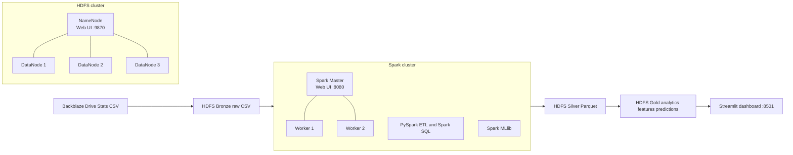

# Sơ đồ service MVP

## Trách nhiệm service

| Service | Vai trò | Cổng host |
|---|---|---|
| `namenode` | Metadata HDFS, WebHDFS và giao diện kiểm tra block/replica | 9870, 9000 |
| `datanode1` đến `datanode3` | Lưu dữ liệu HDFS, replication factor mặc định là 2 | Không expose |
| `spark-master` | Điều phối Spark applications và hiển thị worker/job | 8080, 7077 |
| `spark-worker1`, `spark-worker2` | Chạy ETL, Spark SQL, feature engineering và MLlib | Không expose |
| `ui-dashboard` | Đọc output Gold đã chuẩn bị và hiển thị dashboard | 8501 |

FastAPI chưa nằm trong MVP Compose. Khi dashboard cần API cho dự đoán theo yêu cầu, thêm service `api` sau khi mô hình, định dạng input và contract endpoint đã ổn định.
